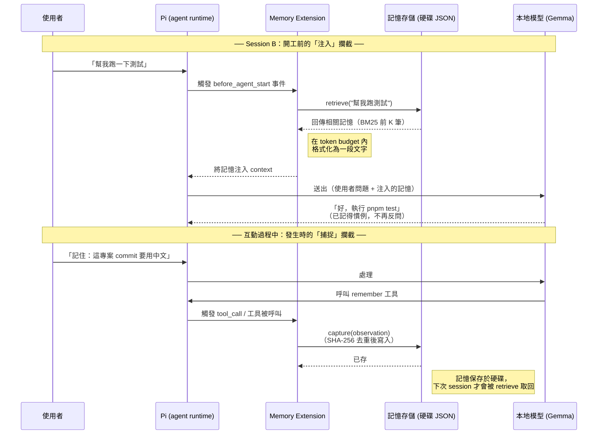

# 📝 作業4：為本地 Coding Agent 打造記憶機制（Pi Memory）

> **課程作業｜Memory Engineering for Agents — Capture, Store, Retrieve, Inject**
> 繳交方式：上傳至 GitHub Classroom
> 執行環境：**完全在本地端執行，不消耗任何雲端 API 費用**
> 主要語言：**Python**（Pi 端只用我們提供、學生不需修改的輕量化 TS bridge）

> Attached References: 
> (1) [HW4-python-starter.zip](HW4-python-starter.zip)
---

## Deadline

| 項目 | 截止時間 |
|---|---|
| **完整繳交（程式碼 + benchmark 結果 + REPORT.md + demo）** | 2026/6/9 23:59 |

> ⚠️ **日期暫定，以課程公告為準。**
> 📌 **不允許遲交，天有不測風雲，請提前繳交。** 繳交前請確認 GitHub Actions CI 顯示綠色 ✅。

---

## 作業目標

> **Memory Engineering for Agents** — Coding agent 每次 session 結束就遺忘一切，使用者必須反覆重述專案慣例與偏好。本作業要你為 [Pi coding agent](https://github.com/earendil-works/pi) 建立一層 context window 之外的**持久記憶**：把 agent 的互動觀察捕捉並存到硬碟，下次 session 開始時依當前任務檢索最相關片段、在 token 預算內注入回 context。核心、benchmark、評分皆為 **Python**，整個系統跑在你自選的本地模型上，不呼叫任何雲端 API。

核心學習目標：

- 實作記憶系統全流程：**Capture → Store → Retrieve → Inject**
- 實踐「確定性外殼包住機率性核心」：把「記憶該記什麼、何時想起」設計成可驗證的確定性邏輯
- 親手把主觀概念（「記憶有沒有用」）**製造成可客觀檢驗的指標**——並用我們提供的 **benchmark（Recall@k / MRR / nDCG）** 量化它
- 體會「context 是稀缺資源」：在本地小模型有限 context 下做注入取捨
- 透過 benchmark 觀察 **lexical BM25 的天花板**，理解業界記憶系統為何走向 hybrid（BM25 + embedding）檢索

---

## 先看一個情境

昨天你告訴 agent：「這專案用 `pnpm` 不要用 `npm`，測試指令是 `pnpm test`。」今天重開 agent，它**完全忘了**。本作業就是要消除這種重複：

```
【昨天 session】你說「這專案用 pnpm，測試是 pnpm test」
  → 外掛把它記起來、寫進硬碟                         ← Capture + Store
【今天 session】你說「幫我跑測試」
  → 外掛找到昨天那筆相關記憶                          ← Retrieve
  → agent 開工前把它注入回 context                   ← Inject
  → agent 直接知道要跑 pnpm test，不必再問你
```

> **名詞小抄**：**session**＝開一次 agent、對話、關掉。｜**observation**＝一筆記憶。｜**retrieve**＝給一句話找出最相關的幾筆。｜**token budget**＝允許注入回 agent 的字數上限。

---

## 🤖 先認識 Pi：它是什麼、為什麼我們用它

### Pi 是一個「可被自己擴充」的 coding agent

[Pi（`earendil-works/pi`）](https://github.com/earendil-works/pi) 是一個開源的 coding agent harness。可以將它理解為一個在終端機執行、能協助讀寫檔案與執行指令的 AI 助手，概念上類似 Claude Code、Cursor、Codex CLI，差別在於它的設計較為精簡、透明且 token 使用效率高，原始碼公開可閱讀。本作業選用 Pi 的原因即在於此：學生可以清楚看到 agent 實際的運作方式，而非面對一個封閉的框架。

> 📌 Pi 的主 repo 目前為 `earendil-works/pi`；舊連結 `badlogic/pi-mono` 可能仍會 redirect，安裝與查文件一律以官方目前的 `earendil-works/pi` 為準。套件名稱為 `@earendil-works/pi-coding-agent`。

Pi 預設提供模型**四個內建工具**：`read`、`write`、`edit`、`bash`，模型透過這四個工具完成讀檔、改檔、寫新檔、執行指令等工作。其餘功能皆以擴充方式加入，可透過 **skills、prompt templates、extensions、pi packages** 四種機制擴充。本作業使用的是其中的 **extension**。

### Pi 的架構（為什麼它適合搭本地模型）

Pi 由數個分層套件組成，理解這個分層有助於說明為何它能輕易切換為本機的 Gemma：

| 套件 | 角色 |
|---|---|
| `pi-coding-agent` | 互動式 CLI 本體（在終端機執行的 `pi`） |
| `pi-agent-core` | agent runtime：負責 tool calling、session 狀態管理、事件迴圈 |
| `pi-ai` | **統一的多供應商 LLM API**（OpenAI / Anthropic / Google / 本地等） |

關鍵在 `pi-ai` 這一層：它將「呼叫哪個模型」抽象為統一介面，因此只需在設定檔指向一個 **OpenAI-compatible 的本地 endpoint**（LM Studio、Ollama、llama-server 皆會提供此類 endpoint），Pi 即可切換為本機模型（例如 Gemma / Qwen / Llama），agent 邏輯無須變動。這也是本作業能達成「完全本地、零 API 成本」的原因（環境設定請參考 patloeber 文章）。

Pi 另內建數個與「記憶」相關的 session 管理指令，可先行操作以對照本作業的內容：`/compact`（壓縮當前對話）、`/new`（開新 session）、`/tree`（瀏覽歷史）、`/fork`（從過去某節點分支）。請注意：這些指令皆屬於「單一 session 內，或 session 之間切換」的操作，並不會將知識持久保存至硬碟、供日後檢索；此一空缺正是本作業要補足的部分。

### 什麼是 Pi extension，為什麼用它來做記憶

**extension 是 Pi 在不改動核心程式的前提下擴充功能的官方機制。** 一個 extension 即一個檔案，以 `export default` 匯出一個函式，接收 Pi 提供的 `ExtensionAPI` 物件，並透過該物件的方法註冊自訂行為。最常用的三個方法：

- `pi.on(event, handler)` — **監聽生命週期事件**。例如監聽 `before_agent_start`（agent 開始工作前）或 `tool_call`（模型呼叫工具時），於該時間點加入自訂邏輯。
- `pi.registerTool(...)` — **註冊新工具**供模型呼叫（例如 `remember` 工具）。
- `pi.registerCommand(...)` — **註冊斜線指令**供使用者手動觸發（例如 `/recall`）。

載入方式：`pi --extension ./your-extension.ts`，或放置於 `~/.pi/agent/extensions/` 由 Pi 自動載入。

**為何記憶機制適合以 extension 實作？** 因為「記憶」本質上對應兩個生命週期時間點的攔截：

1. **在 agent 開工前**（`before_agent_start`）攔截一次 → 將相關記憶**注入**進 context。
2. **在互動發生時**（模型呼叫 `remember` 工具，或 `tool_call` 事件）攔截一次 → 將觀察**捕捉**下來並存入硬碟。

extension 提供的正好就是這兩個攔截點。也就是說，記憶系統不需要修改 Pi 的核心程式，而是以一個獨立的 plugin 模組掛在 agent 的生命週期事件上。

下圖將這兩個攔截點放進一次完整的對話流程中。請留意兩點：**(1)** 注入發生在模型讀取任何訊息之前，因此記憶會在模型開始處理前先補進 context；**(2)** 捕捉發生在互動過程中，將本次互動產生的觀察寫入硬碟，供**後續**的 session 使用。



兩個攔截點各自獨立且互補：**捕捉**負責將知識寫入存儲，**注入**負責在適當時機將知識取回。中間的硬碟存儲（即本作業需實作的 `store` 與 `retrieve`）是跨 session 的關鍵環節——`/compact` 僅在單一 session 內壓縮對話、不會跨 session 保存，因此兩者用途不同。

> 💡 進一步的事件與 API 細節請參考 [Pi extensions 官方文件](https://github.com/earendil-works/pi/blob/main/packages/coding-agent/docs/extensions.md)。本作業已提供寫好的 extension（見下節），因此無須精熟此文件即可完成作業；但理解上述兩個攔截點，有助於理解整個系統的設計依據。

---

## 🏗️ 系統架構（為什麼 Python 為主、Pi 端只是橋）

Pi 的 extension 僅支援 TypeScript，但本作業的記憶系統以 **Python** 實作（此亦符合業界常見做法：記憶系統通常獨立為一個可供多個 agent 呼叫的服務）。本作業已提供一支**寫好、無須修改**的輕量化 TS bridge，讓 Pi 透過 CLI 呼叫 Python 記憶系統：

```
  Pi (本地模型，例如 Gemma/Qwen/Llama)
      │  before_agent_start / remember 工具
      ▼
  pi-bridge/extension.ts   ← 已提供，無須修改
      │  subprocess 呼叫
      ▼
  python -m memory.cli  →  Python 核心（capture / retrieve / inject）
      │
      ▼
  memory.json（硬碟上的持久記憶）
```

本作業需實作的部分皆位於 Python 端；TS bridge 僅負責將 Pi 連接至 Python 記憶系統。

---

## 📁 必繳檔案結構

> ⚠️ **要求 Python >= 3.10。** 請在 `README.md` 聲明你開發用的版本（如 `3.11`），助教以該版本或相近版本複現。

```
AIASE2026-HW4/
├── memory/
│   ├── __init__.py
│   ├── bm25.py             ← BM25 retrieval 計分（你的主戰場）（必要）
│   ├── store.py            ← JSON 持久層（必要）
│   ├── core.py             ← capture/retrieve/inject 串接（已提供，不用改）
│   └── cli.py              ← 給 Pi bridge 的 CLI（已提供，不用改）
├── tests/
│   └── test_memory.py      ← 公開單元測試（隱藏測試格式相同）（必要）
├── benchmark/
│   ├── corpus.jsonl        ← 基準語料 30 筆（study tool，已提供）
│   ├── queries.jsonl       ← 基準查詢 21 題 + 標準答案（已提供）
│   ├── corpus_large.jsonl  ← 大語料 100 筆（自行探索用，已提供）
│   ├── queries_large.jsonl ← 大語料查詢 40 題（自行探索用，已提供）
│   ├── run_benchmark.py    ← 算 Recall@k / MRR / nDCG（已提供）
│   └── README.md           ← benchmark 說明（已提供）
├── pi-bridge/
│   └── extension.ts        ← 輕量化 TS bridge（已提供，不用改）
├── fixtures/observations.json
├── requirements.txt        （必要）
├── README.md               （必要）
├── REPORT.md               （必要）
├── models.json.example
└── demo/                   ← demo 影片連結或截圖（必要；影片建議放 `demo/README.md` 連結）
```

> ⚠️ **`memory/bm25.py`、`memory/store.py`、`tests/`、`requirements.txt` 缺少任一者，核心自動評分無法進行，以 0 分計算。**
> ⚠️ **缺少 `REPORT.md`：報告與分析項（20%）以 0 分計算。缺少 `demo/`：demo 與可重現性相關項以 0 分計算，並標示為不完整繳交，但不影響已通過的核心自動評分。**
> ⚠️ **不可 commit 任何真實 API Key；本作業跑本地模型，原則上無需金鑰。**

---

## 🛠️ 環境與必看資料

### 模型（完全自由選）
挑任何你電腦跑得動的本地模型（Gemma 4、Qwen、Llama、Phi…）。**沒有最低尺寸要求、用小模型不會扣分**——核心由單元測試與 benchmark 客觀驗證，與模型強弱無關；模型只在錄 demo 時用到。請在 README 記錄型號 / context size / 後端 / VRAM。

| 資料 | 用途 |
|---|---|
| [Patrick Loeber, *Local coding agent with Gemma 4 and Pi*](https://patloeber.com/gemma-4-pi-agent/) | **環境設定（先做）**：跑本地 OpenAI-compatible server、設定 Pi |
| [`rohitg00/agentmemory`](https://github.com/rohitg00/agentmemory) | **設計靈感**：完整 capture/store/retrieve/inject pipeline、hybrid search、decay |
| [Pi extensions 文件](https://github.com/earendil-works/pi/blob/main/packages/coding-agent/docs/extensions.md) | bridge 已寫好，欲了解原理可參考 |

---

## 📦 系統元件規範

三部分：**任務一（必做核心）、任務二（至少一項進階）、任務三（反思報告，必做）**。

### 任務一：記憶迴路（必做核心，Python）

完成 `memory/` 裡兩個 TODO（其餘已串好）：

**(a)(b) Capture + Store — `memory/store.py`**
`JsonStore` 的 `load()` / `_persist()` / `add()`：存成 JSON 檔、重啟後可讀回、用 `summary` 的 SHA-256 當 id **去重**。

**(c) Retrieve — `memory/bm25.py` 的 `bm25_search()`（主戰場）**
給定查詢，回傳最相關的前 K 筆。**必須實作標準 BM25**（`tokenize()` 已給，含 CJK 單字切分）：

```
score(q,d) = Σ_qi IDF(qi) · (tf·(k1+1)) / (tf + k1·(1 - b + b·|d|/avgdl))
IDF(qi)    = ln( (N - n + 0.5)/(n + 0.5) + 1 )     建議 k1=1.5, b=0.75
```

**帶數字範例（測試就驗這個）**：三筆 summary——D1 `"this project uses pnpm test"`、D2 `"the project readme is in docs"`、D3 `"run pnpm test before commit"`。查詢 `"pnpm test"`：**D1、D3 應進前 2，D2 分數為 0**。

**(d) Inject — 已提供 `build_injection()`**
在 token 預算（預設 2000）內，照分數高低塞到接近上限為止。

> 💡 **建議順序**：先寫 `bm25.py`（用上面三筆例子驗證）→ 再寫 `store.py` → `core.py` 已接好不用動。`pytest -q` 從「部分紅燈」做到「全綠」。

### 任務二：進階功能（至少一項）

| 功能 | Hint |
|---|---|
| **Hybrid retrieval**（推薦，連結 benchmark） | 在 BM25 上加入 embedding 相似度（可用本地 `sentence-transformers`，與 HW3 相同）。**用 benchmark 證明它修好了純 BM25 接不到的語義/跨語言題。** |

> ⚠️ **若實作 hybrid retrieval，請保留純 BM25 路徑。** `memory/bm25.py::bm25_search()` 必須維持標準、確定性的 BM25，供公開與隱藏測試驗證；不要把 embedding 邏輯直接塞進 `bm25_search()`。Hybrid 請另寫為獨立函式（例如 `hybrid_search()`）或以環境變數 / CLI 參數啟用。

> ⚠️ **embedding 模型的下載與離線規則**：可於安裝或第一次執行時從 Hugging Face 下載開源 embedding model（如 `sentence-transformers`）；但實際作業執行與 demo **不得呼叫雲端推論 API**。若需完全離線，請在 README 記錄模型快取方式。
| **遺忘 Decay** | 加 `last_used_at`，對久未用者乘衰減係數 |
| **壓縮 Consolidation** | 用本地模型把多筆記憶濃縮成摘要（本地跑、零成本） |
| **隱私過濾** | regex 遮除 `sk-...`、`ghp_...`、`password=...` |
| **矛盾偵測** | 同 tag 下新的覆蓋舊的 |
| **`/recall`、`/forget`** | 擴充 CLI / bridge 指令 |

### 任務三：反思報告（必做，`REPORT.md`）

回答：(1) 你如何判斷「記憶有效」、為何指標不可作弊；(2) **附上你的 benchmark 分數**（純 BM25，以及若做 hybrid 的改進後分數），並說明哪幾題純 BM25 接不到、為什麼；(3) 確定性 vs 機率性的分界；(4) token 預算取捨；(5) 與 `/compact` 的關係；(6) 你的系統 vs 手寫 `PROGRESS.md`；(7) 環境記錄。

---

## 📊 Benchmark（記憶檢索評測工具）

本作業提供一個記憶檢索 benchmark，用以**客觀量化**檢索效果，而非依賴主觀判斷。benchmark 含兩組語料，**皆不計入自動評分**：

| 用途 | 語料 / 查詢 | 規模 |
|---|---|---|
| **基準語料**（與單元測試同等級的資料） | `corpus.jsonl` / `queries.jsonl` | 30 筆 / 21 題 |
| **大語料**（供自行探索，較大且較貼近真實） | `corpus_large.jsonl` / `queries_large.jsonl` | 100 筆 / 40 題 |

```bash
# 基準語料（預設）
python benchmark/run_benchmark.py --k 5 --per-query

# 大語料（自行探索）
python benchmark/run_benchmark.py --corpus corpus_large.jsonl --queries queries_large.jsonl --k 5 --per-query
```

兩者皆會將語料存入記憶系統、對每個 query 執行 `retrieve()`，再與標準答案比對，計算 **Recall@k / MRR / nDCG@k**，並印出對應語料的純 BM25 參考值：

| 指標 | 基準語料（k=5） | 大語料（k=5） |
|---|---|---|
| Recall@5 | ≈ 0.81 | ≈ 0.84 |
| MRR | ≈ 0.81 | ≈ 0.83 |
| nDCG@5 | ≈ 0.80 | ≈ 0.80 |

> 💡 **評分與 benchmark 的關係**：benchmark 分數本身**不作為自動測試直接給分**（自動測試僅依據 `tests/` 的單元測試，使用 30 筆等級的固定資料）。但學生**必須**在 REPORT 中提交 benchmark 結果與錯誤分析，該分析的品質列入評量的 20%（見評分表）。換言之，benchmark 是 study tool，不直接計分，但「是否認真量測與分析」會被評。

> 💡 **大語料的觀察重點**：相較於 30 筆基準語料，100 筆版本刻意加入大量同主題、不同細節的記憶（distractor），可呈現 lexical 檢索的兩種限制——(1) **詞彙不匹配**：查詢用字與記憶實際用字不同（例如查詢說 "package manager"，記憶寫的是 pnpm / npm；查詢說 "payment provider"，記憶寫的是 Stripe），純 BM25 因僅比對字面而接不到；(2) **distractor 稀釋**：語料變大後常見詞被多筆共享，正確記憶的排序被雜訊文件擠下。這兩點即 lexical 檢索（BM25）的天花板，也是任務二導入 hybrid retrieval（BM25 + 本地 embedding）想要改善的目標。建議流程：先用大語料量測純 BM25 → 分析哪些題接不到、原因為何 → 實作 hybrid → 重新量測並於 REPORT 比較。更詳細說明見 `benchmark/README.md`。

---

## 📖 README.md 撰寫要求

需讓他人在乾淨環境重現你的系統與測試：(1) 設計概述；(2) 環境（Python / 模型 / context size / 後端 / VRAM）；(3) 安裝與測試（`pip install -r requirements.txt`、`pytest -q`）；(4) 如何跑 benchmark；(5) 如何掛 bridge 到 Pi 並重現 demo；(6) 你做了哪項任務二。

### 接到 Pi 執行（重要：cwd 與 PYTHONPATH）

bridge 透過 `python -m memory.cli` 呼叫本作業的 Python 記憶系統，因此**必須讓 Python 找得到 `memory/` 套件**。請務必在作業 repo 根目錄執行 Pi，並設定 `PYTHONPATH=.`：

```bash
cd AIASE2026-HW4
PYTHONPATH=. pi -e ./pi-bridge/extension.ts
```

> ⚠️ 若將 extension 複製到 `~/.pi/agent/extensions/` 由 Pi 自動載入，請在 README 說明你如何設定 `PYTHONPATH` 或改用絕對路徑，確保 bridge 仍能正確呼叫 Python 記憶系統。本作業提供的 bridge 已預設以其所在 repo 根目錄為工作目錄，但跨平台行為仍請自行確認並於 README 記錄。

---

## 🎯 評分說明

### 自動評分（AI Agent）：60–95 分

| 評分面向 | 配分比重 | 說明 |
|---|---|---|
| **核心記憶迴路正確性** | 40% | `bm25_search` 排序、`store` 去重與持久化、注入預算截斷——由**公開＋隱藏單元測試客觀驗證**（pytest），可重複、不可灌水 |
| **Benchmark 表現與分析** | 20% | benchmark 跑得起來、純 BM25 接近參考值；report 對「哪些題接不到、為何」的分析深度；做 hybrid 者是否用 benchmark 證明改進 |
| **進階功能（任務二）** | 20% | 至少一項可運作、設計合理、trade-off 清楚 |
| **反思報告與可重現性** | 20% | 指標不可 gaming 的論證、確定/機率分界、`/compact` 與 `PROGRESS.md` 比較、README 在乾淨環境可執行 |

- AI 評分相對排序，整體接近 Normal Distribution，$\mu \approx 78\text{–}80$
- 評分準則細節事前不公開，期末公布評分程式碼
- 「核心正確性」由單元測試客觀計分，是本作業 Verifiability Mindset 的具體實踐

### 人工抽查
- 確認 `pytest -q` 與 `benchmark/run_benchmark.py` 在乾淨環境可執行、bridge 可掛載
- 確認 demo 能展示「跨 session 記憶生效」
- **`pytest` 無法執行（核心無法評分）者，核心正確性項以 0 分計算**；demo 因 Pi 環境問題而無法重現者，僅影響 demo 與可重現性項，不波及已通過的核心自動評分
- 抽查加分：核心穩健、hybrid 確實提升 benchmark、demo 清楚者，老師額外加 **1–5 分**

---

## 🤖 GitHub Actions 自動檢查（CI）

每次 `push` 自動檢查：

- ✅ `memory/bm25.py`、`memory/store.py`、`memory/core.py`、`memory/cli.py` 存在
- ✅ `tests/test_memory.py`、`benchmark/run_benchmark.py`、`README.md`、`REPORT.md`、`requirements.txt` 存在
- ✅ `.env` 未被 commit

> ⚠️ **CI 僅檢查基本可執行性。** `retrieve` 的 BM25 正確性由 AI 評分時以**隱藏測試集**驗證（格式同公開測試、資料不同）。**請勿針對公開測試硬編碼答案。**
> ⚠️ **CI 未通過 = 基本條件不符，直接影響成績。** 繳交前請確認顯示綠色 ✅。

---

## 📅 繳交方式

```bash
# 1) 接受 GitHub Classroom 邀請、clone repo
# 2) 完成 memory/bm25.py 與 memory/store.py，本地 pytest 全綠
# 3) 跑 benchmark、把分數寫進 REPORT.md、錄 demo
git add memory/ tests/ benchmark/ REPORT.md README.md requirements.txt demo/
git commit -m "HW4: pi memory (capture/store/retrieve/inject) + benchmark + report"
git push origin main
# 4) 確認 GitHub Actions CI 綠色 ✅
```

---

## ❓ 常見問題

**Q：我電腦 VRAM 很小，只能跑很小的模型，會被扣分嗎？**
A：不會。核心與 benchmark 由程式客觀計分，與模型強弱無關。模型只在錄 demo 時用到。README 註明型號與 context size 即可。

**Q：我完全不會 TypeScript，可以嗎？**
A：可以。`pi-bridge/extension.ts` 已提供且無須修改，需實作的部分皆為 Python。

**Q：核心可以呼叫本地模型幫忙排序嗎？**
A：**不可以。** `bm25_search` / `retrieve` 必須是確定性的（每次結果相同），否則無法自動評分。只有任務二的 consolidation / hybrid embedding 才用到模型，且請保留一個純 BM25 路徑供測試。

**Q：benchmark 的分數算評分嗎？**
A：benchmark 本身是給你迭代用的 study tool，但你在 REPORT 報告的分數與分析會被評（占 20%）。隱藏測試與抽查會比對你宣稱的分數是否屬實。

**Q：純 BM25 有幾題接不到正常嗎？**
A：正常，這是 benchmark 故意設計的語義/跨語言落差。它揭露 lexical retrieval 的天花板——你可以在 report 討論，或在任務二用 hybrid retrieval 把它修好並用 benchmark 證明。

**Q：隱藏測試怎麼測？**
A：格式同 `tests/test_memory.py`，換資料：載入固定 observation、固定查詢、斷言正確記錄在前 K 且排序符合 BM25。**請勿對公開測試硬編碼**。

**Q：Pi 預設 YOLO 執行 bash 安全嗎？**
A：跑本地小模型偶有亂下危險指令風險，開發時建議掛官方 `permission-gate` extension。

---

*如有任何問題，請於 Discord 課程討論區發問。祝大家作業順利！* 🚀